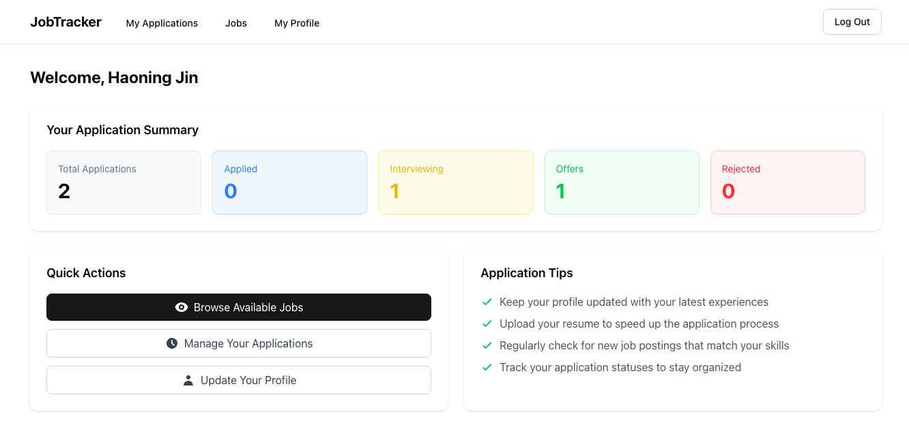
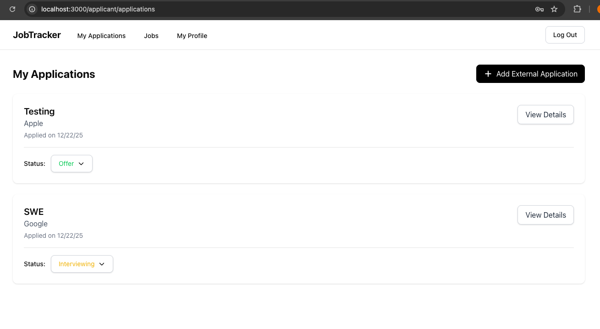
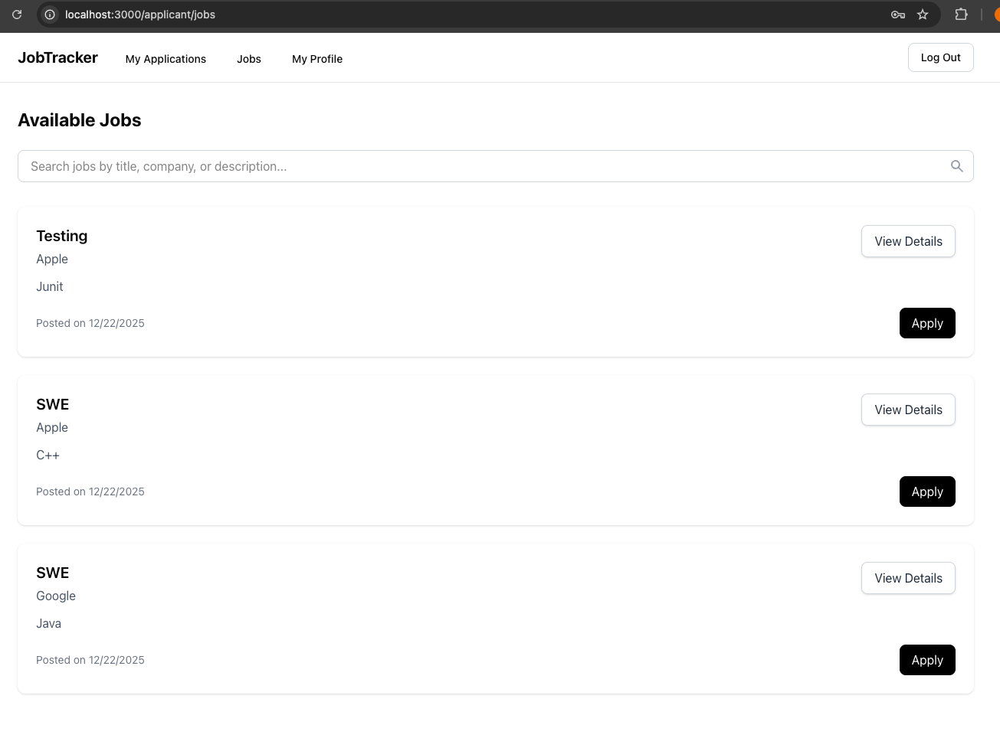
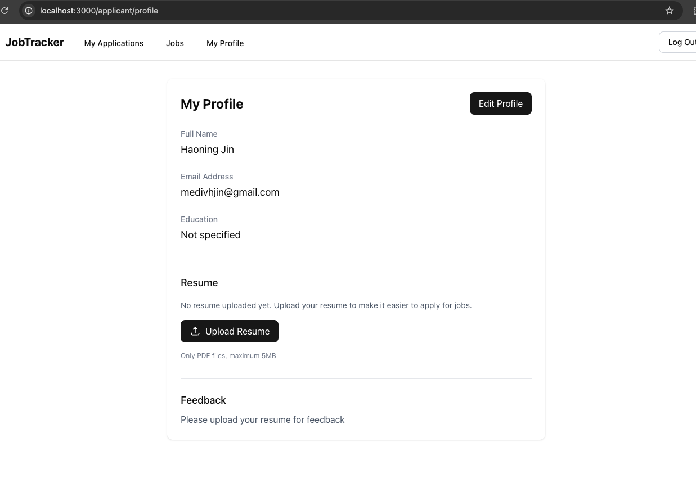
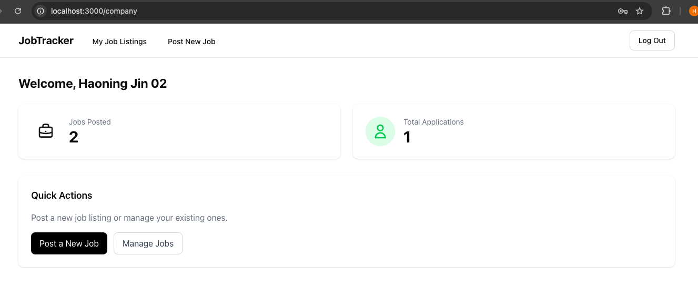
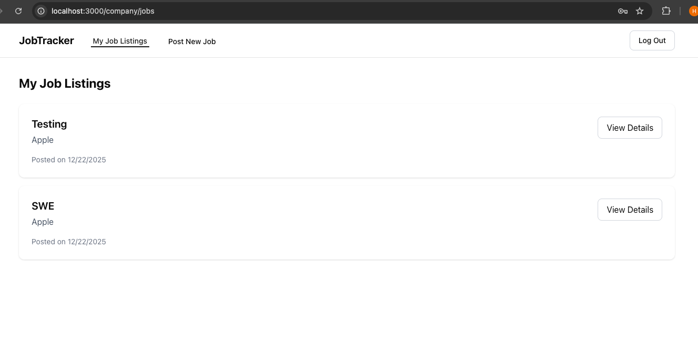
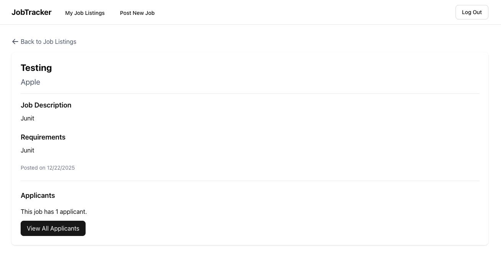
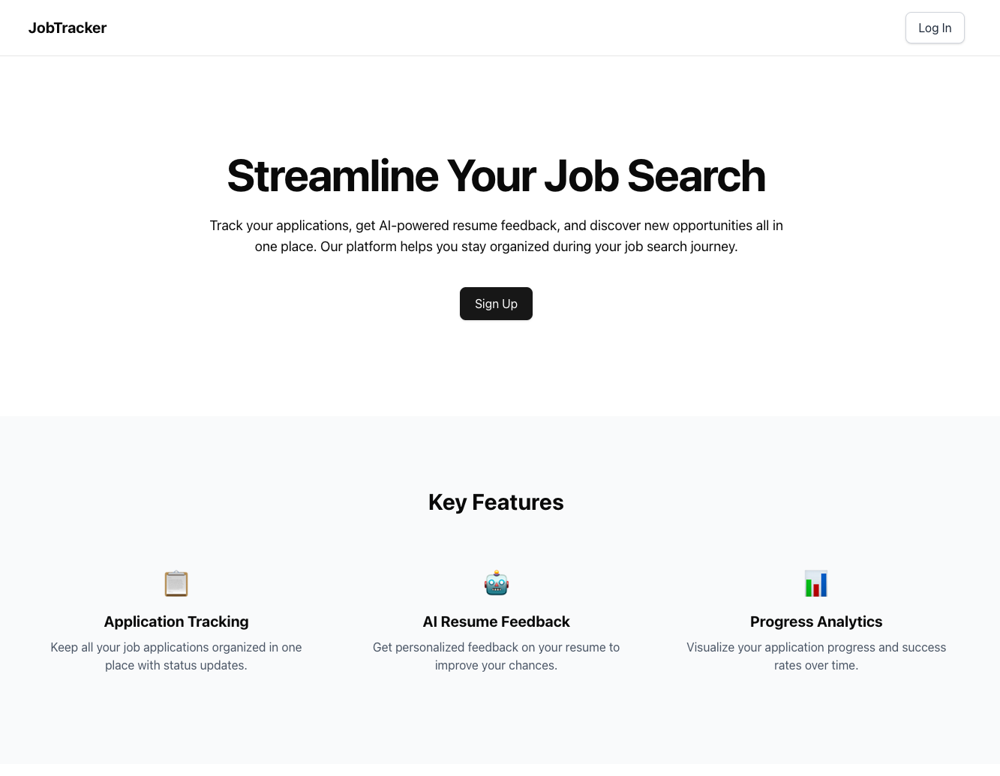
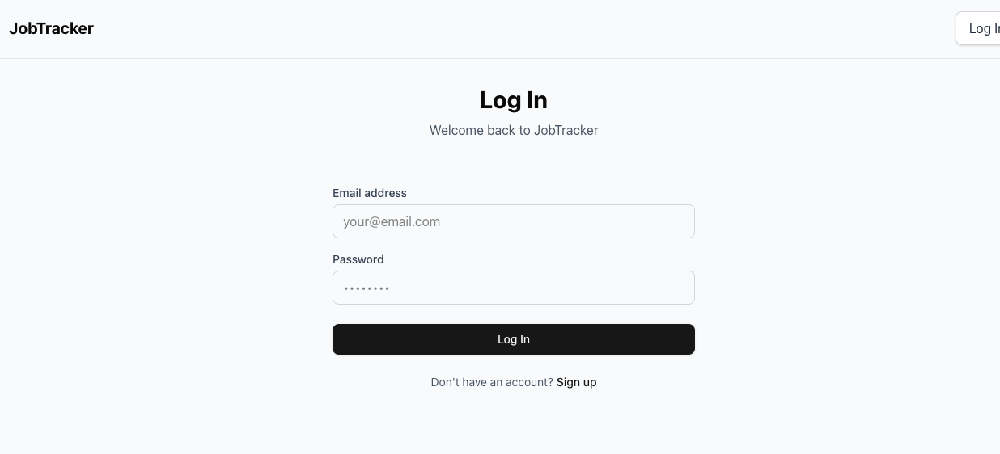
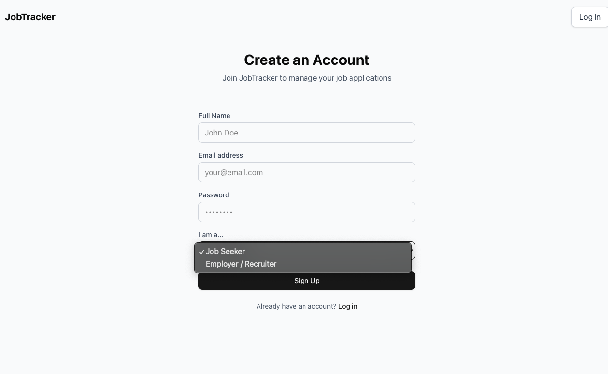

# Job Application Tracker & Recruitment Platform

A full-stack job application tracking and recruitment platform that helps job applicants manage applications and receive AI-powered resume feedback, while enabling recruiters to post jobs and manage candidates — all in one system.

---

## How to Run the App Locally

### 1. Prerequisites
- Node.js 18+
- npm or yarn

### 2. Clone the Repo
    git clone https://github.com/your-username/jobtracker.git
    cd jobtracker

### 3. Install Dependencies
    npm install

### 4. Create .env file in the project root
    REDIS_URL=Redis_URL
    SESSION_TTL_SECONDS=Session_Time
    DATABASE_URL=DB_URL
    JWT_SECRET=JWT_Secret
    OPENAI_API_KEY=OPENAI_API_KEY

### 5. Run
    npm run dev

### 6. Check the App
    http://localhost:3000

---

## Overview

This platform is designed for two user roles:

- **Applicants** – Track job applications, upload resumes, and receive AI feedback  
- **Recruiters** – Post jobs and view applicants  

The application provides role-based dashboards, protected routes, and an intuitive user experience built with modern web technologies.

---

## Applicant Features

- View dashboard with application statistics  
- Track job applications (internal & external)  
- Update application statuses  
- Browse available jobs  
- Apply to jobs directly on the platform  
- Upload and manage resumes  
- View AI-generated resume feedback  
- Edit profile information  

### Applicant UI

---

## Recruiter Features

- View recruiter dashboard  
- Post new job listings  
- View and manage posted jobs  
- View applicants for each job  

### Recruiter UI

---

## Main Page

- Sign up & Log in  

### Public Pages

